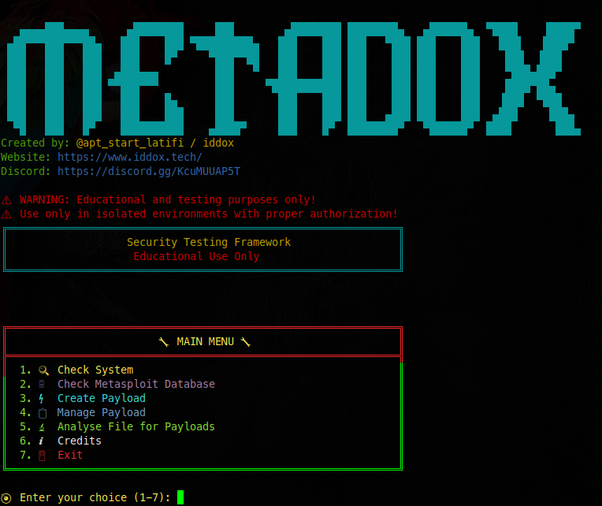

<div align="center">

# 🔧 Metasploit Manager

**A comprehensive security testing framework for educational and authorized testing purposes only.**

[](https://github.com/MetaMops/MetaDox)
[](https://python.org)
[](https://parrotsec.org)
[](https://kernel.org)
[](https://github.com/MetaMops/MetaDox/releases)
[](https://github.com/MetaMops/MetaDox)

</div>

<div align="center">

## ⚠️ **IMPORTANT LEGAL DISCLAIMER**

**THIS TOOL IS FOR EDUCATIONAL AND TESTING PURPOSES ONLY!**

</div>

<div align="center">

| ❌ **PROHIBITED** | ✅ **AUTHORIZED** |
|:---:|:---:|
| 🚫 **Unauthorized Testing** | ✅ **Educational Purposes** |
| 🚫 **Malicious Activities** | ✅ **Authorized Testing** |
| 🚫 **Production Systems** | ✅ **Isolated Environments** |
| 🚫 **Real-World Targets** | ✅ **Proper Authorization** |

</div>

<div align="center">

**⚠️ The developers and contributors are NOT responsible for any misuse of this tool. Users assume full legal responsibility for their actions.**

</div>

## 🖼️ Preview



*Screenshot of the main METADOX interface showing the interactive menu system*

**📁 [View all preview images](preview/Preview.md)**

<div align="center">

## 🚀 Quick Start

</div>

### 📋 **Prerequisites**

<div align="center">

| **Requirement** | **Version** | **Description** |
|:---:|:---:|:---|
| 🐧 **Operating System** | Linux | Tested on Parrot OS \| Linux 6.12.32-amd64 |
| 🐍 **Python** | 3.8+ | Required for running the application |
| ⚡ **Metasploit** | Latest | Framework for payload generation |
| 🔧 **System Tools** | Various | file, strings, objdump, readelf, unzip |

</div>

### 🛠️ **Installation**

<div align="center">

| **Step** | **Command** | **Description** |
|:---:|:---:|:---|
| 1️⃣ | `git clone https://github.com/MetaMops/MetaDox.git` | Clone repository |
| 2️⃣ | `cd MetaDox-main` | Navigate to project directory |
| 3️⃣ | `pip install -r requirements.txt` | Install Python dependencies |
| 4️⃣ | `sudo apt install metasploit-framework file binutils unzip` | Install system tools |
| 5️⃣ | `sudo python3 main.py` | Run the application |

</div>

### 🎯 **Quick Commands**

```bash
# Clone and setup
git clone https://github.com/MetaMops/MetaDox.git
cd MetaDox-main
pip install -r requirements.txt

# Install system tools (Ubuntu/Debian/Kali)
sudo apt update
sudo apt install metasploit-framework file binutils unzip

# Run the application
sudo python3 main.py
```

<div align="center">

## 🎯 Features

</div>

<div align="center">

| **Feature** | **Description** | **Icon** |
|:---:|:---:|:---:|
| 🔍 **System Check** | Verify Metasploit installation and system requirements | ✅ |
| 🗄️ **Database Management** | Initialize and manage Metasploit database | ✅ |
| ⚡ **Payload Creation** | Generate payloads for multiple platforms | ✅ |
| 📋 **Payload Management** | Connect to and manage active payloads | ✅ |
| 🔬 **File Analysis** | Analyze files for embedded payloads and malware | ✅ |
| ℹ️ **Credits** | View developer information and legal notices | ✅ |

</div>

## 📁 Project Structure

```
metasploit-manager/
├── main.py                 # Main application entry point
├── requirements.txt        # Python dependencies
├── checkfiles/            # Directory for files to analyze
├── payload_configs/       # Generated payload configurations
├── handlers/              # Payload handler configurations
├── modules/               # Core application modules
│   ├── file_analysis/     # File analysis system
│   ├── payloads/          # Payload generation modules
│   └── ...
└── docs/                  # Comprehensive documentation
```

## 🔧 Usage

1. **Start the application:**
   ```bash
   sudo python3 main.py
   ```

2. **Follow the interactive menu:**
   - Choose option 1 to check system requirements
   - Choose option 2 to initialize Metasploit database
   - Choose option 3 to create payloads
   - Choose option 4 to manage payloads
   - Choose option 5 to analyze files for payloads

3. **For file analysis:**
   - Place files to analyze in the `checkfiles/` directory
   - Use option 5 to access the file analysis system
   - Select files from the list for analysis

<div align="center">

## 📚 Documentation

</div>

<div align="center">

| **Document** | **Description** | **Link** |
|:---:|:---:|:---:|
| 📖 **Complete Documentation** | Comprehensive project documentation | [View](docs/README.md) |
| 🔬 **File Analysis Guide** | Detailed file analysis documentation | [View](docs/FILE_ANALYSIS.md) |
| ⚡ **Payload Creation Guide** | Payload generation documentation | [View](docs/PAYLOAD_CREATION.md) |
| ⚖️ **Legal and Ethics** | Legal disclaimers and ethical guidelines | [View](docs/LEGAL_ETHICS.md) |
| 🔧 **Troubleshooting** | Common issues and solutions | [View](docs/TROUBLESHOOTING.md) |
| 🤝 **Contributing Guidelines** | How to contribute to this project | [View](CONTRIBUTING.md) |

</div>

## 🛡️ Security Notice

This tool is designed for:
- ✅ **Educational purposes** - Learning about cybersecurity
- ✅ **Authorized testing** - Testing systems you own or have permission to test
- ✅ **Research** - Security research in controlled environments
- ✅ **Training** - Cybersecurity training and exercises

<div align="center">

## 📞 Contact & Support

</div>

<div align="center">

[](https://www.iddox.tech/)
[](https://discord.gg/KcuMUUAP5T)
[](mailto:latifimods@gmail.com)
[](https://github.com/MetaMops/MetaDox/)

</div>

## 📄 License

This project is licensed under the **Educational Use Only** license. See [LICENSE](LICENSE) for details.

## ⚖️ Legal Compliance

By using this tool, you agree to:
- Use it only for educational and authorized testing purposes
- Comply with all applicable laws and regulations
- Not use it for malicious or illegal activities
- Assume full legal responsibility for your actions

<div align="center">

---

## 🛡️ **Remember: With great power comes great responsibility. Use this tool ethically and legally!**

[](https://github.com/MetaMops/MetaDox)
[](https://github.com/MetaMops/MetaDox/fork)
[](https://github.com/MetaMops/MetaDox/issues)

</div>
