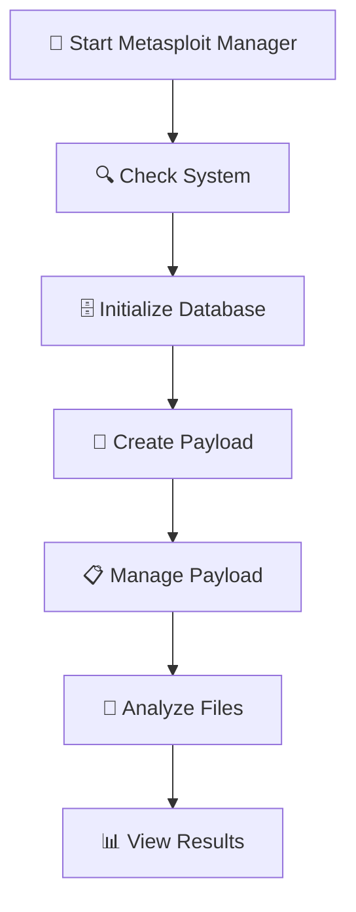

# 📖 Metasploit Manager Usage Guide

<div align="center">


**🚀 Get Started with Metasploit Manager in Minutes!**

</div>

---

## ⚡ **Quick Start**

### 1️⃣ **Start Metasploit Manager**
```bash
cd /path/to/MetaDox
pip3 install -r requirements.txt
sudo python3 main.py
```

### 2️⃣ **Create Payload**
```
🎯 Main Menu → Option 3: Create Payload
├── Choose platform (Windows/Linux/macOS/Android/Java/Web)
├── Select payload type (Reverse TCP/Bind TCP/HTTP/HTTPS)
├── Configure LHOST, LPORT, encoder
└── Payload saved in ./payload_configs/
```

### 3️⃣ **Manage Payload**
```
🎯 Main Menu → Option 4: Manage Payload
├── Connect with TCP Reverse
├── Connect with TCP Bind
└── Start handlers for active payloads
```

### 4️⃣ **Analyze Files**
```
🎯 Main Menu → Option 5: Analyse File for Payloads
├── Check Files (from checkfiles/ directory)
├── Check Links (URL analysis - placeholder)
└── Select file type for detailed analysis
```

---

## 📁 **Directory Structure**

```
MetaDox/
├── 📁 main.py                      # Main application entry point
├── 📁 modules/                     # Core application modules
│   ├── 🎯 create_payload.py        # Payload creation
│   ├── 📋 manage_payload.py        # Payload management
│   ├── 🔬 file_analysis/           # File analysis system
│   ├── 🗄️ metasploit_db.py         # Database management
│   └── 🔍 check_system.py          # System verification
├── 📁 payload_configs/             # Generated payload configurations
├── 📁 handlers/                    # Payload handler configurations
├── 📁 checkfiles/                  # Files to analyze
└── 📁 docs/                        # Comprehensive documentation
```

---

## 🎯 **Complete Workflow**

<div align="center">



</div>

---

## 🔧 **Important Notes**

### 📁 **File Analysis Directory**
- **✅ Correct:** `./checkfiles/` (place files to analyze here)
- **❌ Wrong:** Any other directory

### 🔍 **File Analysis**
- **🤖 Automatic** - Detects file types and routes to appropriate analyzer
- **🎯 Use:** Option 5 "Analyse File for Payloads"
- **⏱️ Wait:** Analysis takes 5-30 seconds depending on file size

### 🎧 **Payload Management**
- **🌐 Auto-starts** handlers for configured payloads
- **📋 Shows** connection instructions
- **🔄 Runs** in background

---

## 🐛 **Troubleshooting**

### ❌ **File Analysis Failed**
1. ✅ Check if file is in `checkfiles/` directory
2. ✅ Verify file permissions
3. ✅ Check if file type is supported

### ❌ **Payload Creation Failed**
1. ✅ Check if Metasploit is installed
2. ✅ Verify system requirements
3. 🔄 Try different payload type

### ❌ **Database Connection Failed**
1. ✅ Run "Check Metasploit Database" (Option 2)
2. ✅ Initialize database if needed
3. 🔄 Restart database services

---

## 📋 **Example Session**

<div align="center">

| **Step** | **Action** | **Menu Option** |
|:---:|:---:|:---|
| 🖥️ **1** | Start Metasploit Manager | `sudo python3 main.py` |
| 🔍 **2** | Check System | Option 1: Check System |
| 🗄️ **3** | Initialize Database | Option 2: Check Metasploit Database |
| 🎯 **4** | Create Payload | Option 3: Create Payload |
| 📋 **5** | Manage Payload | Option 4: Manage Payload |
| 🔬 **6** | Analyze Files | Option 5: Analyse File for Payloads |

</div>

---

## 🎉 **Success Indicators**

When everything works correctly:

- ✅ **System checked** and requirements verified
- ✅ **Database initialized** and connected
- ✅ **Payload created** in `./payload_configs/`
- ✅ **File analysis** completed with results

---

## 🎮 **Menu Navigation**

```
🎯 METASPLOIT MANAGER MAIN MENU
═══════════════════════════════════

1️⃣  🔍 Check System
2️⃣  🗄️  Check Metasploit Database
3️⃣  ⚡ Create Payload              ← Start here!
4️⃣  📋 Manage Payload             ← Manage sessions
5️⃣  🔬 Analyse File for Payloads  ← Analyze files
6️⃣  ℹ️  Credits
7️⃣  🚪 Exit
```

---

## 🎯 **Payload Creator Menu**

```
🎯 PAYLOAD CREATOR
═══════════════════════════════════

1️⃣  🪟 Windows Payloads
2️⃣  🐧 Linux Payloads
3️⃣  🍎 macOS Payloads
4️⃣  📱 Android Payloads
5️⃣  ☕ Java Payloads
6️⃣  🌐 Web Payloads
7️⃣  🔧 Other Payloads
8️⃣  🔙 Back to Main Menu
```

---

## 📋 **Payload Management Menu**

```
📋 PAYLOAD MANAGEMENT
═══════════════════════════════════

1️⃣  🔄 Connect with TCP Reverse
2️⃣  🔗 Connect with TCP Bind
3️⃣  🔙 Back to Main Menu
```

---

## 🔬 **File Analysis Menu**

```
🔬 FILE ANALYSIS
═══════════════════════════════════

1️⃣  📁 Check Files (from checkfiles/)
2️⃣  🔗 Check Links (URL analysis)
0️⃣  🔙 Back to Analysis Menu
```

---

<div align="center">

## 🎯 **Ready to Start?**

[](https://discord.gg/KcuMUUAP5T)
[](https://github.com/MetaMops/MetaDox)

**💬 Need help? Join our Discord community!**

</div>