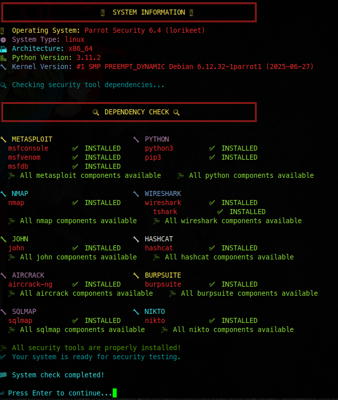
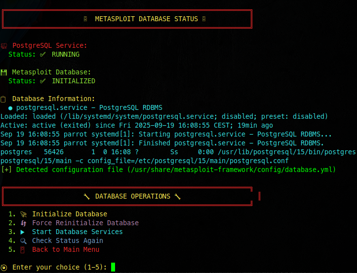
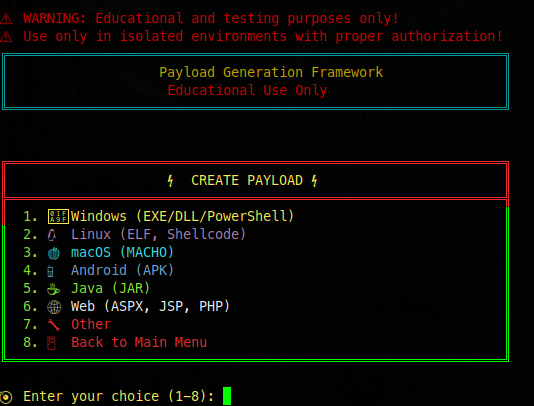
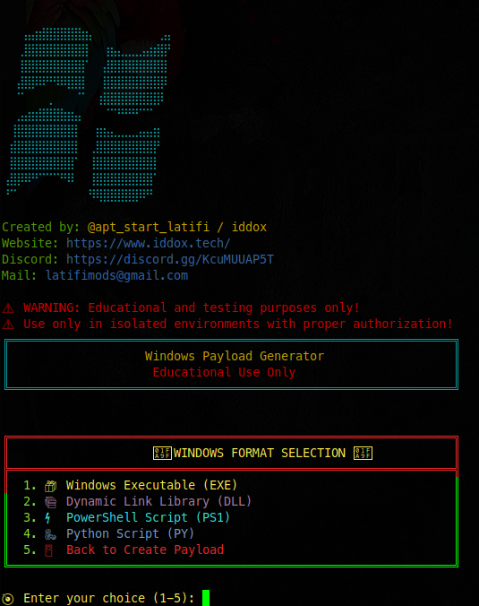
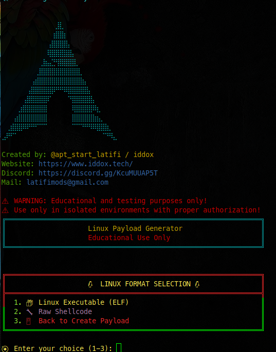
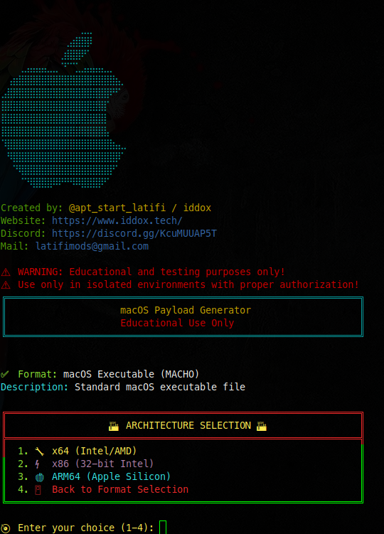
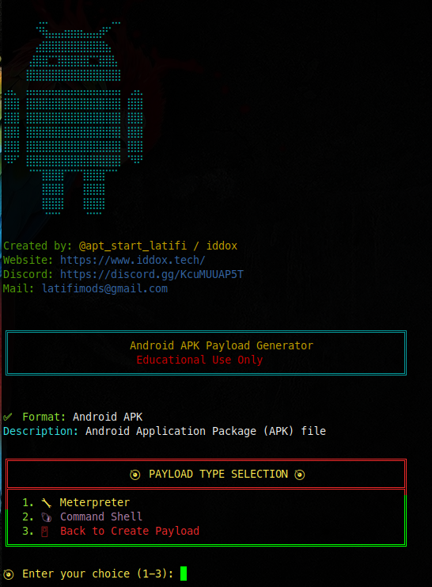
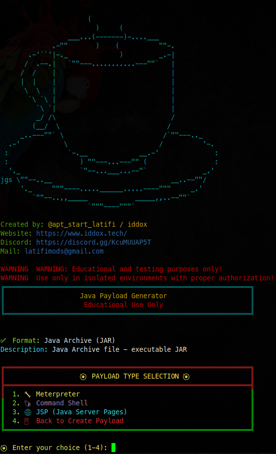
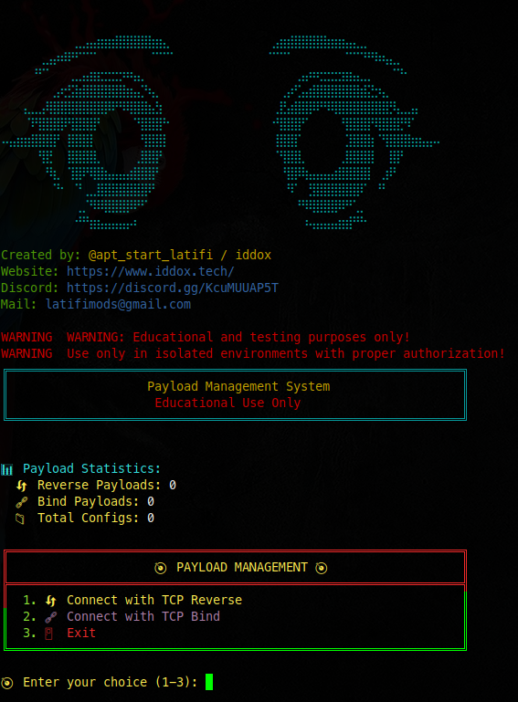
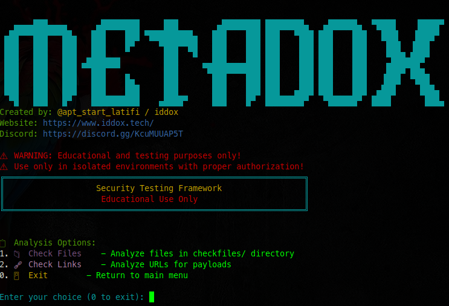

# 🖼️ Tool Preview

**Screenshots of Metasploit Manager in Action**

*All interface screenshots showing the various features and modules*

---

## 📱 **Main Interface**

| **Main Menu** | **System Information** |
|:---:|:---:|
|  |  |
| *Main application interface with ASCII art banner* | *System check and verification results* |

---

## 🗄️ **Database Management**

| **Database Status** |
|:---:|
|  |
| *Metasploit database initialization and management* |

---

## ⚡ **Payload Creation**

| **Payload Menu** | **Windows Payloads** |
|:---:|:---:|
|  |  |
| *Payload creation main menu* | *Windows payload generation interface* |

| **Linux Payloads** | **macOS Payloads** |
|:---:|:---:|
|  |  |
| *Linux payload generation interface* | *macOS payload generation interface* |

| **Android Payloads** | **Java Payloads** |
|:---:|:---:|
|  |  |
| *Android payload generation interface* | *Java payload generation interface* |

| **Web Payloads** |
|:---:|
|  |
| *Web payload generation interface* |

---

## 📋 **Payload Management**

| **Payload Management** |
|:---:|
|  |
| *Payload management and connection interface* |

---

## 🔬 **File Analysis**

| **File Analysis Interface** |
|:---:|
|  |
| *File analysis system with multiple file type support* |

---

## 🎯 **Key Features Shown**

### **Main Interface**
- ✅ **ASCII Art Banner** - Professional MetaDox branding
- ✅ **Colorful Menu** - Intuitive navigation system
- ✅ **System Status** - Real-time system information

### **Payload Generation**
- ✅ **Multi-Platform Support** - Windows, Linux, macOS, Android, Java, Web
- ✅ **Professional Interface** - Clean, organized payload creation
- ✅ **Configuration Options** - LHOST, LPORT, encoders, and more

### **File Analysis**
- ✅ **Multiple File Types** - Support for 11 different file formats
- ✅ **Detailed Analysis** - Comprehensive payload detection
- ✅ **Color-Coded Results** - Clear infected/clean indicators

### **Database Management**
- ✅ **Metasploit Integration** - Seamless database operations
- ✅ **Status Monitoring** - Real-time database status
- ✅ **Easy Initialization** - One-click database setup

---

## 🚀 **Ready to Get Started?**

**💬 Need help? Join our Discord community!**

---

**⚠️ Remember: This tool is for educational purposes only. Use responsibly and legally!** 🛡️
